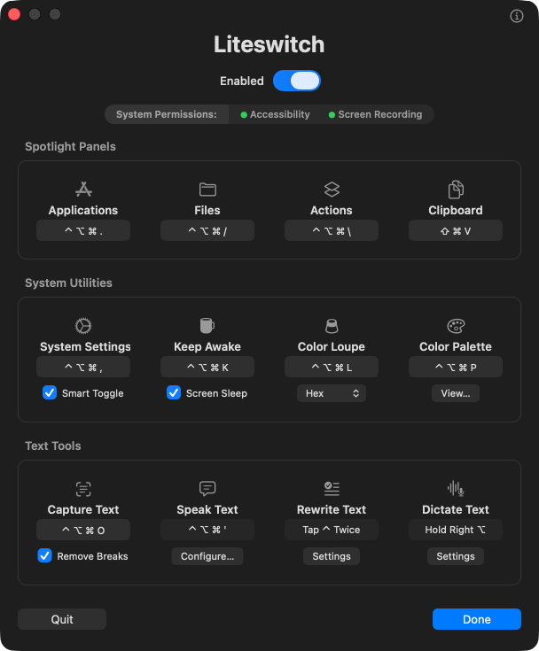

# Liteswitch

[](https://github.com/grokcodile/liteswitch/releases/latest)
[](https://github.com/grokcodile/homebrew-tap)
[](https://github.com/grokcodile/liteswitch/releases)
[](#requirements)
[](LICENSE)

**The most powerful things macOS can do are often the hardest to reach — Liteswitch puts them at your fingertips.**



macOS ships the hard part and leaves out the key. Screen OCR, color sampling, sleep prevention, dictation, on-device text cleanup — the engines are all in the box, on-device, already paid for, and mostly a menu dive or a Settings pane away. That gap is a whole category of paid utilities: apps that bundle their own engine, or their own subscription, to sell you a keystroke. Liteswitch is a dozen of those keystrokes in one background agent — one Swift file, no dependencies, no menu bar item, no account, no subscription, nothing leaving your Mac.

It's also built to be temporary wherever it can be. Each tool covers a convenience macOS misses by a hair, so when a future release closes that gap, the tool comes out. **The app getting smaller as the system gets better is a success, not a regression** — simplicity here is the point of the thing, not a marketing line.

## What it leverages instead of reinventing

Every tool here is a thin shortcut onto an Apple framework or system service. Nothing bundles its own engine.

| Tool | What macOS does the work | Instead of |
|---|---|---|
| **Apps** | Spotlight's Applications panel, opened via the system `Apps.app` stub | Alfred, Raycast, LaunchBar (paid tiers) |
| **Files** | Spotlight's Files panel — the same index Finder searches | Alfred / Raycast file search, Find Any File |
| **Actions** | Spotlight's Actions panel — Shortcuts and system actions by name | Raycast commands, Alfred workflows |
| **Clipboard** | Spotlight's own clipboard history | Paste, Copy'em, Raycast clipboard history |
| **System Settings** | `NSWorkspace`, with a remembered "toggle back" | — |
| **Keep Awake** | **IOKit power assertions** — the same mechanism as `caffeinate` | Amphetamine, Caffeine, KeepingYouAwake |
| **Color Loupe** | **`NSColorSampler`** — the system's own loupe, sampling out of process | Sip, ColorSlurp (paid tiers) |
| **Color Palette** | Liteswitch's own store + `NSFilePromiseProvider` drag-out | the paid tier of most color pickers |
| **Speak Text** | **Spoken Content** — macOS's own text-to-speech, its Siri voices, its shortcut | text-to-speech utilities |
| **Capture Text** | **Vision** (`VNRecognizeTextRequest`) on-device OCR + `screencapture -i` | TextSniper (paid) |
| **Rewrite Text** | **Apple Intelligence** on-device (`FoundationModels`) | Grammarly and friends (subscriptions) |
| **Dictate Text** | **macOS Dictation**, on-device — driven through the Accessibility API | Wispr Flow, superwhisper (subscriptions) |

The four Spotlight panels are the starkest case: an app launcher, a file searcher, a command runner and a clipboard history are four separate paid utilities in most people's setups, and macOS 26 ships all four — behind one keystroke and a number. They just needed keys of their own.

Two more that make the point:

- **Dictate Text** — dictation apps sell push-to-talk with their own speech model and a monthly bill. Your Mac already transcribes on-device, for free, at least as well. The *only* thing it lacks is hold-to-talk: macOS dictation is toggle-only. So that's all this adds — the missing key, on top of Apple's transcription.
- **Rewrite Text** — cleaning up, restyling or translating text is exactly what an on-device LLM is for, and macOS 26 ships one. No API key, no per-token cost, no text uploaded anywhere.

## Features

**Spotlight Panels**

- A global shortcut for each of **Apps, Files, Actions, Clipboard**. One shortcut per panel; recording a combo another panel owns moves it over.
- **Apps** opens through the system's own `Apps.app` stub — instant, no permissions (with a synthesized fallback if the stub ever moves).
- **Files / Actions / Clipboard** open by synthesizing the documented Spotlight gesture, then clearing the leftover query so you always start typing into an empty field.

**System Utilities**

- **System Settings** — with **Smart Toggle**, pressing the shortcut again hides it and returns you to the app you came from.
- **Keep Awake** — stops your Mac sleeping; a cup appears in the menu bar while it's on (click to stop), and **Screen Sleep** lets the display sleep while the system stays up. The assertion releases automatically if Liteswitch quits, so it can't strand your Mac awake.
- **Color Loupe** — pops the system loupe and copies the pixel under your cursor as **Hex, RGB, HSL, or SwiftUI**, plus the raw color for dropping into a color well. A pill flashes the swatch and code, and every pick is saved to Color Palette.
- **Color Palette** — a window of everything you've picked. **Click** a swatch to re-copy its code, **drag** it out to save the swatch as a PNG, **pin** the keepers. Labels default to the hex and can be renamed. Keeps the last 20; pins persist at the top.

**Text Tools**

- **Speak Text** — mirrors macOS's own **Speak selection**. The card shows the shortcut macOS has assigned it, and **Configure…** opens a window walking through switching it on in Read & Speak. It mirrors rather than re-implements for a measured reason: the Siri voices are the ones worth listening to, and no public API vends them. `AVSpeechSynthesizer` refuses them outright and silently substitutes a fallback; `NSSpeechSynthesizer` exposes exactly one, and is deprecated besides. Voices sitting on disk as several hundred megabytes of neural model — `nora`, `quinn` — render byte-identical audio to a made-up voice name when requested through either. macOS is the only thing that can read to you in them, so macOS does the talking.
- **Capture Text** — drag a region and its text is recognized on-device and copied, with a pill showing how much was grabbed. **Remove Breaks** flows it onto one line. A native TextSniper.
- **Rewrite Text** — triggered by **tapping ⌃ twice** rather than a recorded shortcut, it rewrites the selected text with Apple Intelligence's on-device model, or the whole field if nothing is selected. It holds any number of named **rewrite actions** — Clean Up ships built in, alongside Professional, Friendly, Shorten, Translate to Spanish and Wrap in HTML — and the shortcut offers a menu of the ones you've selected. Tick none and it just cleans up; tick one and it runs straight through. Any action can also take a shortcut of its own, which skips the menu whether or not it's ticked. **Auto-Correct** on the Dictate Text card keeps its own instructions and stays out of the menu.
- **Dictate Text** — hold **Right ⌥** or **Right ⌘** and it dictates; release and it stops. **Auto-Correct** runs only where the app can say exactly which characters dictation inserted; elsewhere it says so and leaves your words alone rather than guessing at the span. A waveform meter shows green while listening, then amber for a moment while dictation catches up — press again during that to carry straight on. With **Auto-Correct** on it turns purple while the model rewrites, and the hold key is ignored until that's done: the two waits behave differently, so they don't look the same.

**Throughout**

- Every control has a one-line tooltip, and the **ⓘ** in the titlebar opens a popover — links to [HELP.md](HELP.md), the source, and the tip jar. What each of the twelve tools does, with a couple of uses each, lives in [HELP.md](HELP.md) rather than in the app.
- **Protected apps…** (in the ⓘ popover) disables Liteswitch while you're using the apps you list — a remote session, a game, anything that owns the same chords. It unregisters its shortcuts while one of them is frontmost and takes them back on the way out, so there is nothing to shadow the app's own bindings.
- Shortcut conflicts with other apps are surfaced in the settings window rather than failing silently.
- Runs as a background agent — no Dock icon, no menu bar item — and starts at login. Opening it again brings up settings.

## Install

### Homebrew (easiest — also handles updates)

```sh
brew install --cask grokcodile/tap/liteswitch
```

New versions arrive with `brew upgrade --cask liteswitch`.

### Download the app

1. Download the latest **[Liteswitch.zip](https://github.com/grokcodile/liteswitch/releases/latest/download/Liteswitch.zip)** (or browse [all releases](https://github.com/grokcodile/liteswitch/releases)).
2. Unzip it and drag **Liteswitch** into your `Applications` folder.

The released build is signed with a Developer ID and notarized by Apple, so it opens normally — no "unidentified developer" warning. macOS may show a one-time "downloaded from the Internet" confirmation; just click **Open**.

### Build and install

```sh
bash install.sh    # → /Applications/Liteswitch.app, running
```

This is the one to use if you're working on it. It builds, quits whatever copy is already running, replaces `/Applications/Liteswitch.app`, and relaunches — then tells you how many copies are running, which should always be one.

**Don't run the app out of `./build`.** `build.sh` starts by deleting that directory, so a running instance has its bundle pulled out from under it: the process survives, but macOS now sees the rebuilt bundle as a different app and launching it starts a *second* copy instead of reusing the first. They stack up silently, and they don't coexist peacefully — every instance registers the same global hotkeys and installs its own dictation monitor, so one keypress fires N times and N Auto-Correct passes rewrite the same text while each is pasting into it.

### Build only

```sh
bash build.sh    # → ./build/Liteswitch.app
```

Builds without installing — what `install.sh` and `notarize.sh` both call.

If a **Developer ID Application** certificate is in your keychain, `build.sh` finds it and signs with it, using the hardened runtime and a trusted timestamp. Otherwise it falls back to an ad-hoc signature.

That distinction matters for more than distribution: **macOS ties Accessibility and Screen Recording to the signing identity**, and an ad-hoc build gets a new identity every time it's compiled — so every rebuild appears to macOS as a different app and the permissions have to be granted again. Signed with a stable Developer ID, they're granted once and stay. (It's the identity that counts, not the location, so moving the app to `/Applications` doesn't cost you the grants.)

### Notarizing a release

```sh
bash notarize.sh    # → ./dist/Liteswitch.zip, stapled
```

Signing alone still leaves Gatekeeper showing the "unidentified developer" warning on someone else's Mac; notarizing is what clears it. One-time setup, which stores an app-specific password in your keychain:

```sh
xcrun notarytool store-credentials liteswitch --apple-id "you@example.com" --team-id YOURTEAMID
```

Make the app-specific password at [appleid.apple.com](https://appleid.apple.com) under Sign-In and Security — it isn't your Apple ID password. After that, `notarize.sh` builds, submits, waits for Apple, staples the ticket into the bundle, and leaves a distributable zip in `dist/`.

### Cutting a release

Releases are built by GitHub Actions ([`.github/workflows/release.yml`](.github/workflows/release.yml)). Pushing a tag is the whole process:

```sh
git tag v0.3 && git push origin v0.3
```

That runs on a `macos-26` runner and, in order: imports the Developer ID certificate, stamps the version from the tag into `Info.plist`, builds, checks the binary really is arm64, notarizes and staples, zips the stapled app, publishes a GitHub Release with generated notes, and bumps `version` and `sha256` in the Homebrew cask so `brew upgrade --cask liteswitch` picks it up.

**The tag is the version.** `Info.plist` is stamped during the build rather than committed, so the tag and the shipped app can never disagree. Running the workflow manually (`workflow_dispatch`) builds and notarizes without publishing, and leaves the zip as an artifact — useful for checking a build before tagging.

It needs six repository secrets. Each step is skipped rather than failed when its secrets are absent, so a partly-configured repo still builds:

| Secret | What it is |
| --- | --- |
| `MACOS_CERT_P12_BASE64` | Developer ID Application certificate, exported as `.p12`, base64-encoded |
| `MACOS_CERT_PASSWORD` | the password set when exporting that `.p12` |
| `AC_API_KEY_ID` | App Store Connect API key ID |
| `AC_API_ISSUER_ID` | App Store Connect issuer ID |
| `AC_API_KEY_BASE64` | the `.p8` API key file, base64-encoded |
| `TAP_PUSH_TOKEN` | a token with `contents:write` on `grokcodile/homebrew-tap` |

Notarization uses an App Store Connect API key rather than an Apple ID and app-specific password: it's the non-interactive path, and it doesn't put an account password in CI.

```sh
base64 -i Certificates.p12 | gh secret set MACOS_CERT_P12_BASE64
base64 -i AuthKey_XXXXXXXX.p8 | gh secret set AC_API_KEY_BASE64
```

The app icon ships pre-generated (`icon/AppIcon.icns`); regenerate it from the vector source with `icon/make-icns.sh` (needs `brew install librsvg`).

## Requirements

- **macOS 26 or later** (the four-panel Spotlight).
- **Accessibility** — for anything that synthesizes keystrokes or reads another app's menus: Files, Actions, Clipboard, the System Settings shortcut, Dictate Text, and Rewrite Text.
- **Screen Recording** — for **Capture Text** only (macOS 26 gates the region selector behind it).
- **Apple Intelligence** — for **Rewrite Text**, which uses the on-device model. Without it that one tool is unavailable; everything else is unaffected.

Nothing needs setting up in advance: macOS prompts the first time a shortcut needs a permission. The settings window shows a light for each, and clicking a red one asks for it directly.

**Apps, Color Loupe, Color Palette, Keep Awake and Speak Text need no permissions at all.**

## First run

1. Launch **Liteswitch**. Its settings window opens.
2. Record a shortcut for each tool you want, then click **Done**. It keeps running in the background and starts at login — silently, without showing the window.
3. The first time you fire a shortcut that needs a permission, macOS asks. The light turns green once granted.

## Shortcuts

A fresh install comes with a working set already assigned — **⌃⌥⌘ plus a key under your right hand**:

| | | | |
|---|---|---|---|
| ⌃⌥⌘. Applications | ⌃⌥⌘/ Files | ⌃⌥⌘\\ Actions | ⌃⌥⌘V Clipboard |
| ⌃⌥⌘, System Settings | ⌃⌥⌘K Keep Awake | ⌃⌥⌘L Color Loupe | ⌃⌥⌘P Color Palette |
| Speak Text: macOS's own | ⌃⌥⌘O Capture Text | Rewrite Text: **tap ⌃ twice** | Hold **Right ⌥** to dictate |

Three modifiers look heavy written down, but the left hand takes them as one shape and never moves, so every trigger key sits under the right — no chord crosses the keyboard. It's also the one combination nothing else claims: ⌃ alone hits the text-editing bindings macOS puts in every field (⌃A, ⌃K, ⌃H), ⌥ alone eats the character it would otherwise type, and ⌘ belongs to whatever app is frontmost.

Every key earns its place. **`/` finds and `\` does** — mirrored symbols, one for paths, one for escapes. **`,`** is the preferences key every Mac app already uses, **`V`** the paste key for the paste history. The rest are initials: **L**oupe, **H**istory, **K**eep awake, **O**CR, **P**roofread.

**Return and Delete can't be assigned**, and the recorder refuses them. Return means "activate" inside every panel these shortcuts open, so a press that outlives the chord lands in the panel itself and leaves it stuck half-open; Delete is already the gesture for clearing a binding.

Change any of them by clicking the field and recording, or press **Delete** while recording to clear it. Defaults are only ever applied to a tool that has no shortcut yet, so they can't overwrite something you've set.

Two tools work differently, because a recorded chord isn't the right control for them:

- **Dictate Text** takes a **held modifier** (Right ⌥ / Right ⌘), not a chord — a Carbon hotkey never reports the key's release, and push-to-talk needs it.
- **Speak Text** has no Liteswitch shortcut at all. It shows the one **macOS** has assigned to Speak selection, since that feature is macOS's own.

Each card carries one option: **Smart Toggle** for System Settings (on), **Screen Sleep** for Keep Awake (on), the copy **format** for Color Loupe (Hex), **View…** for Color Palette, **Remove Breaks** for Capture Text (on), **Settings** for Rewrite Text, and **Auto-Correct** for Dictate Text (on).

## How it works

Shortcuts are registered as **Carbon global hotkeys** (`RegisterEventHotKey`) — no event tap, so Liteswitch never sits in your keyboard's event path. **Apps** launches `/System/Applications/Apps.app` via `NSWorkspace`. The other panels post the documented Spotlight gesture — ⌘Space, a ~30 ms beat, then the panel's ⌘-number — waiting first for you to release any lingering modifiers so the chord lands clean. While that sequence is in flight Liteswitch's own hotkeys are parked, which is what lets ⌘1–⌘4 themselves be the global shortcuts without re-triggering. A Delete follows the panel key to clear Spotlight's leftover query — deliberately a bare Delete rather than ⌘A + Delete, because if the sequence ever misfires into the frontmost app, select-all-and-delete would wipe a document.

**Color Loupe** uses `NSColorSampler`, the system's own loupe. The sampling happens out of process, so Liteswitch never reads your screen and needs no Screen Recording. The pick lands as the **code text** plus the raw **`NSColor`**. It's text-only by design: an experiment to also copy a swatch *image* had to be dropped, because macOS's clipboard history snapshots any copied image and, on recall, re-offers it as that snapshot's file URL — which made recalling a color paste a file *path* instead of the code. **Color Palette** exists to cover what that swatch was for: seeing past colors visually.

**Capture Text** shells out to `/usr/sbin/screencapture -i` for the region selection, then runs Apple's on-device **Vision** OCR (`VNRecognizeTextRequest`) on the result. Recognition is entirely local.

**Keep Awake** holds an **IOKit power assertion** (`IOPMAssertionCreateWithName`) — the same mechanism `caffeinate` uses — choosing the display-sleep or system-sleep variant to match the Screen Sleep option. Assertions die with the process, so quitting always releases it.

**Dictate Text** watches the chosen modifier with `flagsChanged` monitors, since Carbon hotkeys report presses but never releases. Starting dictation took some ruling out: the mic key on F5 can't be synthesized — macOS takes it at the HID layer, so it never becomes an event an app can post — and by default dictation has no ordinary shortcut to send either. So Liteswitch presses the frontmost app's **Edit ▸ Start / Stop Dictation** item through the **Accessibility API**, which leaves your own dictation setup untouched. The stop is deferred ~1.5 s because dictation keeps transcribing after you stop speaking; pressing the key again inside that window carries on rather than restarting.

**Rewrite Text** runs the text through **`FoundationModels`**, Apple Intelligence's on-device model, with your instructions. Nothing is sent anywhere and there's no API key. The selection is copied, rewritten, and pasted back, with the clipboard borrowed and restored around the round trip. In apps that publish no accessibility information — Zed is one — a successful copy is *not* evidence that anything was selected: they hand over the field's text either way. A selection can also vanish while the model is thinking, since those apps drop it when they aren't being typed into. So before pasting, Liteswitch copies again and checks it gets the same text back. If it does, the selection survived and the paste replaces it; if nothing comes back, it stops and asks you to select again rather than appending the rewrite to the text it was meant to replace. With nothing selected it presses ⌘A first and takes the whole field — except after dictation, where the selection is an estimate and selecting all would rewrite the document rather than the sentence you just spoke.

## Built on macOS, and moving with it

Liteswitch targets **macOS 26** and deliberately uses what that release ships — the four-panel Spotlight, on-device Vision OCR, Spoken Content, macOS Dictation, Apple Intelligence's local model. That's the point of the app, and also its exposure: it is a thin layer over Apple's own behavior, so when that behavior moves, this moves with it.

Some of what's here already rests on things Apple never promised to keep still — the Spotlight ⌘Space gesture and its panel numbers, the **Edit ▸ Start Dictation** menu item that Dictate Text presses, the Spoken Content preference that Speak Text reads. Those work today. A future macOS could rename a menu item, restructure a pane, or change how a panel opens, and the tool that leans on it would need adjusting. Where a behavior is undocumented or was arrived at by testing rather than by the docs, [How it works](#how-it-works) says so.

**The better outcome is that Apple absorbs some of this.** Several of these tools exist purely because a convenience is missing by a hair: dictation transcribes beautifully but is toggle-only; the Spotlight panels have numbers but no global keys; the loupe samples a color but keeps no history. If macOS grows push-to-talk dictation, or lets you bind a panel directly, then that card has served its purpose and should be removed rather than defended. Liteswitch is meant to be scaffolding over the gaps, not a permanent parallel implementation.

So: expect this to track macOS releases, expect the occasional fix when Apple shifts something underneath, and expect features to retire when the system makes them unnecessary.

## Uninstall

1. Open Liteswitch, toggle the switch to **Disabled** (this removes the login item), then click **Quit**. (Or just `killall Liteswitch`.)
2. Delete **Liteswitch.app** from `Applications`.
3. Optionally remove its entry under System Settings → Privacy & Security → Accessibility.

Installed with Homebrew, steps 1 and 2 are `brew uninstall --cask liteswitch`; add `--zap` to take the preferences file with it.

## The name

You flip a light switch without looking at it — that's the bar: the thing you want, on, in one motion, from anywhere. And it's *lite*: one Swift file, no dependencies, no Dock icon, no menu bar item, no data collection.

## Notes

Liteswitch synthesizes keystrokes to drive Spotlight, which is incompatible with the Mac App Store sandbox — it's built from source for now.

## License

Released under the [MIT License](LICENSE).

## Author

Built by **Ethan Darling** — [@grokcodile](https://github.com/grokcodile) on GitHub · [u/grokcodile](https://www.reddit.com/user/grokcodile) on Reddit · [LinkedIn](https://www.linkedin.com/in/ethandarling/).
