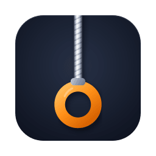

# LiteSwitch

[](#requirements)
[](LICENSE)

**LiteSwitch puts a global shortcut on things your Mac already knows how to do.**

macOS ships the hard part and leaves out the key. Screen OCR, color sampling, sleep prevention, dictation, on-device text cleanup — the engines are all in the box, on-device, already paid for, and mostly a menu dive or a Settings pane away. That gap is a whole category of paid utilities: apps that bundle their own engine, or their own subscription, to sell you a keystroke. LiteSwitch is a dozen of those keystrokes in one background agent — one Swift file, no dependencies, no menu bar item, no account, no subscription, nothing leaving your Mac.

It's also built to be temporary wherever it can be. Each tool covers a convenience macOS misses by a hair, so when a future release closes that gap, the tool comes out. **The app getting smaller as the system gets better is a success, not a regression** — simplicity here is the point of the thing, not a marketing line.

## What it leverages instead of reinventing

Every tool here is a thin shortcut onto an Apple framework or system service. Nothing bundles its own engine.

| Tool | What macOS does the work | Instead of |
|---|---|---|
| **Apps** | Spotlight's Applications panel, opened via the system `Apps.app` stub | Alfred, Raycast, LaunchBar (paid tiers) |
| **Files** | Spotlight's Files panel — the same index Finder searches | Alfred / Raycast file search, Find Any File |
| **Actions** | Spotlight's Actions panel — Shortcuts and system actions by name | Raycast commands, Alfred workflows |
| **Clipboard** | Spotlight's own clipboard history | Paste, Copy'em, Raycast clipboard history |
| **System Settings** | `NSWorkspace`, with a remembered "toggle back" | — |
| **Color Picker** | **`NSColorSampler`** — the system's own loupe, sampling out of process | Sip, ColorSlurp (paid tiers) |
| **Color History** | LiteSwitch's own store + `NSFilePromiseProvider` drag-out | the paid tier of most color pickers |
| **Capture Text** | **Vision** (`VNRecognizeTextRequest`) on-device OCR + `screencapture -i` | TextSniper (paid) |
| **Keep Awake** | **IOKit power assertions** — the same mechanism as `caffeinate` | Amphetamine, Caffeine, KeepingYouAwake |
| **Speak Text** | **Spoken Content** — macOS's own text-to-speech, its voices, its shortcut | text-to-speech utilities |
| **Hold to Dictate** | **macOS Dictation**, on-device — driven through the Accessibility API | Wispr Flow, superwhisper (subscriptions) |
| **Tidy Text** | **Apple Intelligence** on-device (`FoundationModels`) | Grammarly and friends (subscriptions) |

The four Spotlight panels are the starkest case: an app launcher, a file searcher, a command runner and a clipboard history are four separate paid utilities in most people's setups, and macOS 26 ships all four — behind one keystroke and a number. They just needed keys of their own.

Two more that make the point:

- **Hold to Dictate** — dictation apps sell push-to-talk with their own speech model and a monthly bill. Your Mac already transcribes on-device, for free, at least as well. The *only* thing it lacks is hold-to-talk: macOS dictation is toggle-only. So that's all this adds — the missing key, on top of Apple's transcription.
- **Tidy Text** — cleaning up dictated speech is exactly what an on-device LLM is for, and macOS 26 ships one. No API key, no per-token cost, no text uploaded anywhere.

## Features

**Spotlight panels**

- A global shortcut for each of **Apps, Files, Actions, Clipboard**. One shortcut per panel; recording a combo another panel owns moves it over.
- **Apps** opens through the system's own `Apps.app` stub — instant, no permissions (with a synthesized fallback if the stub ever moves).
- **Files / Actions / Clipboard** open by synthesizing the documented Spotlight gesture, then clearing the leftover query so you always start typing into an empty field.

**System tools**

- **System Settings** — with **Smart Toggle**, pressing the shortcut again hides it and returns you to the app you came from.
- **Color Picker** — pops the system loupe and copies the pixel under your cursor as **Hex, RGB, HSL, or SwiftUI**, plus the raw color for dropping into a color well. A pill flashes the swatch and code.
- **Color History** — a window of everything you've picked. **Click** a swatch to re-copy its code, **drag** it out to save the swatch as a PNG, **pin** the keepers. Labels default to the hex and can be renamed. Keeps the last 20; pins persist at the top.
- **Capture Text** — drag a region and its text is recognized on-device and copied, with a pill showing how much was grabbed. **Remove Breaks** flows it onto one line. A native TextSniper.
- **Keep Awake** — stops your Mac sleeping; a cup appears in the menu bar while it's on (click to stop), and **Screen Sleep** lets the display sleep while the system stays up. The assertion releases automatically if LiteSwitch quits, so it can't strand your Mac awake.
- **Speak Text** — mirrors macOS's own **Speak selection**. The card shows the shortcut macOS has assigned it, and **Set Up… / Change…** opens Spoken Content. LiteSwitch reflects that state; macOS does the talking.
- **Hold to Dictate** — hold **Right ⌥** or **Right ⌘** and it dictates; release and it stops. A waveform meter shows green while listening, then amber for a moment while dictation catches up — press again during that to carry straight on.
- **Tidy Text** — rewrites the selected text with Apple Intelligence's on-device model, following instructions you set. Two sets, for two jobs: light proofreading for text you typed, and disfluency-stripping for dictation (fillers, false starts, doubled words, run-on speech). **Auto-Tidy** on the Hold to Dictate card runs the dictated set automatically on what you just spoke.

**Throughout**

- Every group has a **ⓘ** that lays a help sheet over it, explaining each tool with examples and a suggested shortcut.
- Shortcut conflicts with other apps are surfaced in the settings window rather than failing silently.
- Runs as a background agent — no Dock icon, no menu bar item — and starts at login. Opening it again brings up settings.

## Install

### Build from source

```sh
bash build.sh    # → ./build/LiteSwitch.app (ad-hoc signed)
```

Copy `build/LiteSwitch.app` into `Applications` and launch it. An ad-hoc build isn't notarized, so its first launch shows the "unidentified developer" warning — clear it once by right-clicking **LiteSwitch → Open**.

The app icon ships pre-generated (`icon/AppIcon.icns`); regenerate it from the vector source with `icon/make-icns.sh` (needs `brew install librsvg`).

## Requirements

- **macOS 26 or later** (the four-panel Spotlight).
- **Accessibility** — for anything that synthesizes keystrokes or reads another app's menus: Files, Actions, Clipboard, the System Settings shortcut, Hold to Dictate, and Tidy Text.
- **Screen Recording** — for **Capture Text** only (macOS 26 gates the region selector behind it).
- **Apple Intelligence** — for **Tidy Text**, which uses the on-device model. Without it that one tool is unavailable; everything else is unaffected.

Nothing needs setting up in advance: macOS prompts the first time a shortcut needs a permission. The settings window shows a light for each, and clicking a red one asks for it directly.

**Apps, Color Picker, Color History, Keep Awake and Speak Text need no permissions at all.**

## First run

1. Launch **LiteSwitch**. Its settings window opens.
2. Record a shortcut for each tool you want, then click **Done**. It keeps running in the background and starts at login — silently, without showing the window.
3. The first time you fire a shortcut that needs a permission, macOS asks. The light turns green once granted.

## Shortcuts

A fresh install comes with a working set already assigned — **⌃ plus a letter that stands for something**, which keeps it memorable and leaves ⌘-chords to whatever app you're in:

| | | | |
|---|---|---|---|
| ⌃A Applications | ⌃/ Files | ⌃X Actions | ⌃V Clipboard |
| ⌃` System Settings | ⌃L Color Picker | ⌃H Color History | ⌃K Keep Awake |
| ⌃O Capture Text | ⌃P Tidy Text | Hold **Right ⌥** to dictate | Speak Text: macOS's own |

Change any of them by clicking the field and recording, or press **Delete** while recording to clear it. Defaults are only ever applied to a tool that has no shortcut yet, so they can't overwrite something you've set.

Two tools work differently, because a recorded chord isn't the right control for them:

- **Hold to Dictate** takes a **held modifier** (Right ⌥ / Right ⌘), not a chord — a Carbon hotkey never reports the key's release, and push-to-talk needs it.
- **Speak Text** has no LiteSwitch shortcut at all. It shows the one **macOS** has assigned to Speak selection, since that feature is macOS's own.

Each card carries one option: the copy **format** for Color Picker (Hex), **View…** for Color History, **Smart Toggle** for System Settings (on), **Remove Breaks** for Capture Text (on), **Screen Sleep** for Keep Awake (on), **Auto-Tidy** for Dictate Text (on), and **Instructions…** for Tidy Text.

## How it works

Shortcuts are registered as **Carbon global hotkeys** (`RegisterEventHotKey`) — no event tap, so LiteSwitch never sits in your keyboard's event path. **Apps** launches `/System/Applications/Apps.app` via `NSWorkspace`. The other panels post the documented Spotlight gesture — ⌘Space, a ~30 ms beat, then the panel's ⌘-number — waiting first for you to release any lingering modifiers so the chord lands clean. While that sequence is in flight LiteSwitch's own hotkeys are parked, which is what lets ⌘1–⌘4 themselves be the global shortcuts without re-triggering. A Delete follows the panel key to clear Spotlight's leftover query — deliberately a bare Delete rather than ⌘A + Delete, because if the sequence ever misfires into the frontmost app, select-all-and-delete would wipe a document.

**Color Picker** uses `NSColorSampler`, the system's own loupe. The sampling happens out of process, so LiteSwitch never reads your screen and needs no Screen Recording. The pick lands as the **code text** plus the raw **`NSColor`**. It's text-only by design: an experiment to also copy a swatch *image* had to be dropped, because macOS's clipboard history snapshots any copied image and, on recall, re-offers it as that snapshot's file URL — which made recalling a color paste a file *path* instead of the code. **Color History** exists to cover what that swatch was for: seeing past colors visually.

**Capture Text** shells out to `/usr/sbin/screencapture -i` for the region selection, then runs Apple's on-device **Vision** OCR (`VNRecognizeTextRequest`) on the result. Recognition is entirely local.

**Keep Awake** holds an **IOKit power assertion** (`IOPMAssertionCreateWithName`) — the same mechanism `caffeinate` uses — choosing the display-sleep or system-sleep variant to match the Screen Sleep option. Assertions die with the process, so quitting always releases it.

**Hold to Dictate** watches the chosen modifier with `flagsChanged` monitors, since Carbon hotkeys report presses but never releases. Starting dictation took some ruling out: the mic key on F5 can't be synthesized — macOS takes it at the HID layer, so it never becomes an event an app can post — and by default dictation has no ordinary shortcut to send either. So LiteSwitch presses the frontmost app's **Edit ▸ Start / Stop Dictation** item through the **Accessibility API**, which leaves your own dictation setup untouched. The stop is deferred ~1.5 s because dictation keeps transcribing after you stop speaking; pressing the key again inside that window carries on rather than restarting.

**Tidy Text** runs the text through **`FoundationModels`**, Apple Intelligence's on-device model, with your instructions. Nothing is sent anywhere and there's no API key. The selection is copied, rewritten, and pasted back, with the clipboard borrowed and restored around the round trip.

## Built on macOS, and moving with it

LiteSwitch targets **macOS 26** and deliberately uses what that release ships — the four-panel Spotlight, on-device Vision OCR, Spoken Content, macOS Dictation, Apple Intelligence's local model. That's the point of the app, and also its exposure: it is a thin layer over Apple's own behaviour, so when that behaviour moves, this moves with it.

Some of what's here already rests on things Apple never promised to keep still — the Spotlight ⌘Space gesture and its panel numbers, the **Edit ▸ Start Dictation** menu item that Hold to Dictate presses, the Spoken Content preference that Speak Text reads. Those work today. A future macOS could rename a menu item, restructure a pane, or change how a panel opens, and the tool that leans on it would need adjusting. Where a behaviour is undocumented or was arrived at by testing rather than by the docs, [How it works](#how-it-works) says so.

**The better outcome is that Apple absorbs some of this.** Several of these tools exist purely because a convenience is missing by a hair: dictation transcribes beautifully but is toggle-only; the Spotlight panels have numbers but no global keys; the loupe samples a color but keeps no history. If macOS grows push-to-talk dictation, or lets you bind a panel directly, then that card has served its purpose and should be removed rather than defended. LiteSwitch is meant to be scaffolding over the gaps, not a permanent parallel implementation.

So: expect this to track macOS releases, expect the occasional fix when Apple shifts something underneath, and expect features to retire when the system makes them unnecessary.

## Uninstall

1. Open LiteSwitch, toggle the switch to **Disabled** (this removes the login item), then click **Quit**. (Or just `killall LiteSwitch`.)
2. Delete **LiteSwitch.app** from `Applications`.
3. Optionally remove its entry under System Settings → Privacy & Security → Accessibility.

## The name

You flip a light switch without looking at it — that's the bar: the thing you want, on, in one motion, from anywhere. And it's *lite*: one Swift file, no dependencies, no Dock icon, no menu bar item, no data collection.

## Notes

LiteSwitch synthesizes keystrokes to drive Spotlight, which is incompatible with the Mac App Store sandbox — it's built from source for now.

## License

Released under the [MIT License](LICENSE).

## Author

Built by **Ethan Darling** — [@grokcodile](https://github.com/grokcodile) on GitHub · [u/grokcodile](https://www.reddit.com/user/grokcodile) on Reddit · [LinkedIn](https://www.linkedin.com/in/ethandarling/).
